# Mechanics App

This is the source code of an App i developed for the App Store back in 2018, The app was uploaded for 4 months and gained 100+ downloads. This was the first iOS app I developed and the source code is a bit all over the place. Regardless here it is:

## Content
* [History](#history)
* [Target Demographic](#target-demographic)
* [Analytics](#analytics)
* [App Structure](#app-structure)
* [Preview](#preview)
* [Adjusting Ad Mob](#adjusting-ad-mob)
* [The Future](#the-future)
* [Social Media](#social-media)

## History 
This app was developed during my first term of sixth form, I was bored of the mechanics syllabus and was tired of having to recalculate the suvat formulas. I initially designed the app to calculate suvat formulas but then adjusted it to cover majority of the AS Mechanics syllabus. 

## Target Demographic
This app is designed for students, in particular the app was designed for students doing the A-Level Maths Syllabus. Although no advertisements were places the App gained traction naturally on the appstore. I didn't conduct any extra analysis on the users, so the only analytics I recieved were from Apple, and Google (Ad Mob). 

## Analytics
The app was available on the app store from 12/07/2017 to 01/01/2019, so all of the analytics from apple will be based on this. 

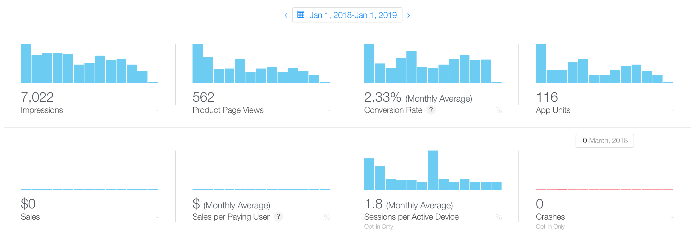

We can see the app had 7,000 impressions, of this the amount of users that clicke on the page totalled to 560. This is about 
8% of users that clicked on the app, to improve this value I could've redesigned the app icon and made it more intruiging. Of the 560 users that clicked on the app around 120 users actually installed the app, so that is roughly 21% of the users who had clicked on the app page. This is relatively high (given the context) and I'd say was mostly down to the app screenshots which were clear and minimalistic. 

Although from the same image we can see that on average the app was used 1.8 times a month, this told me the app was not practical and there was not a demand for this app. After this figure remained constant I stopped developing the app and let the year come to an end to evaluate the analytics. 

One positive from the chart is that the App was robust enough not to crash a single time. 

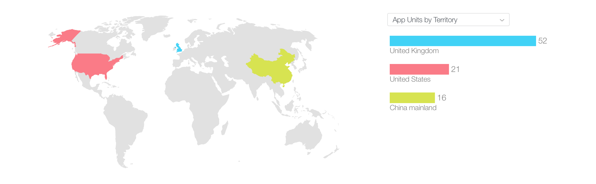

From the map above we can see how closely we got to our target demographic. As you can see, majority of the users (51) came from the UK, which was the demographic then 21 coming from the United States and the remaining coming from china and other aspects. This was the biggest surprise to me. I expected only students studing the A-Level maths syllabus to download this app. 

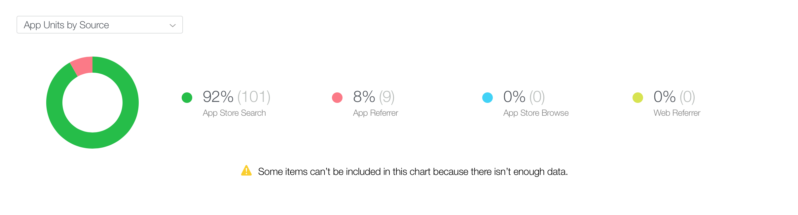

This chart shows how users located the app, we can see majority of the users found the app by searching for it, and a few who came from app referal. Which was as expected since i did not conduct any marketing for this app. 

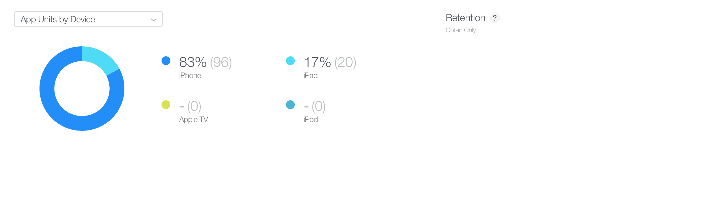

The next chart shows what devices the users used. My initial expectation was the app would be mostly used on IPhones but to my surprise there was a fair amount of IPad users (17%), the app was configured for the IPad, and IPhone X (New resolution releast at the time).

The next segment will evaluate the amount of money the app generated. The app made money by publishing ads on its screen. i opted for the banner ad since anything else would cover majority of the screen. 

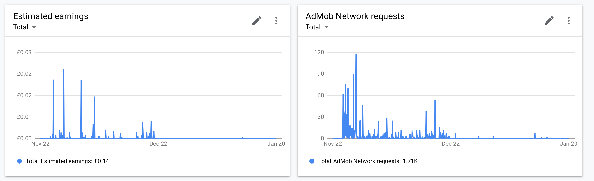
As you can see, the app generated a total of £0.14 over the course of a year...
Not great, but considering the statistics discussed earlier and the fact this app was only made as a project for myself better than expected. The app made a total of 1,710 requests to Ad Mob, which means the ads were presented to users 1,710 times. The graph shows that the app was subject to surges in ad requests randomly throughout the year. I haven't found a reason for this. 

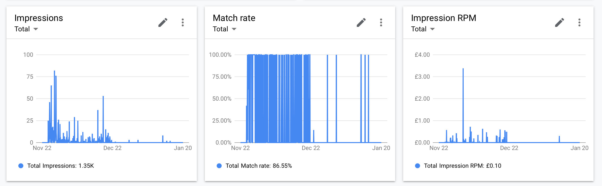
This graph is about advertisement match rate and impressions. This doesn't really mean too much to me since this was a personal project.

## App Structure 
The app had a tree structure, this can be seen quite clearly using XCode. The landing page can be considered the root node, and each section being a branch. 

## Preview 
Below are the images of the mechanics app running on an IPhone X 
 
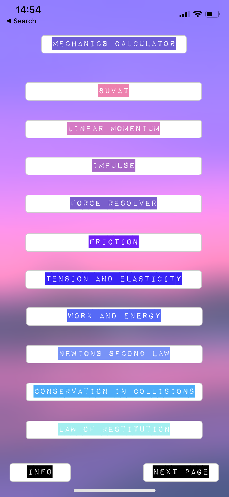
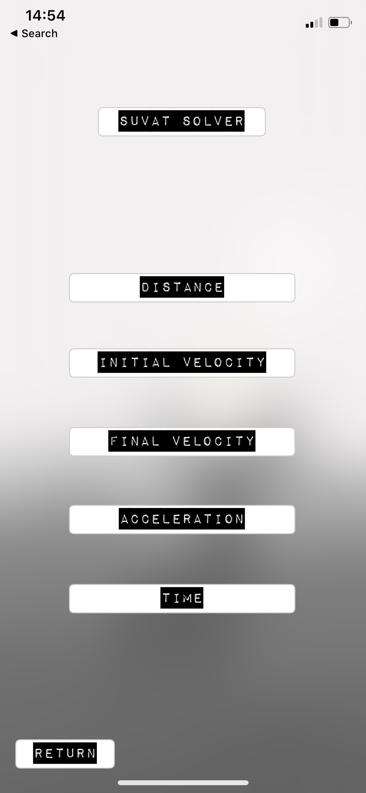
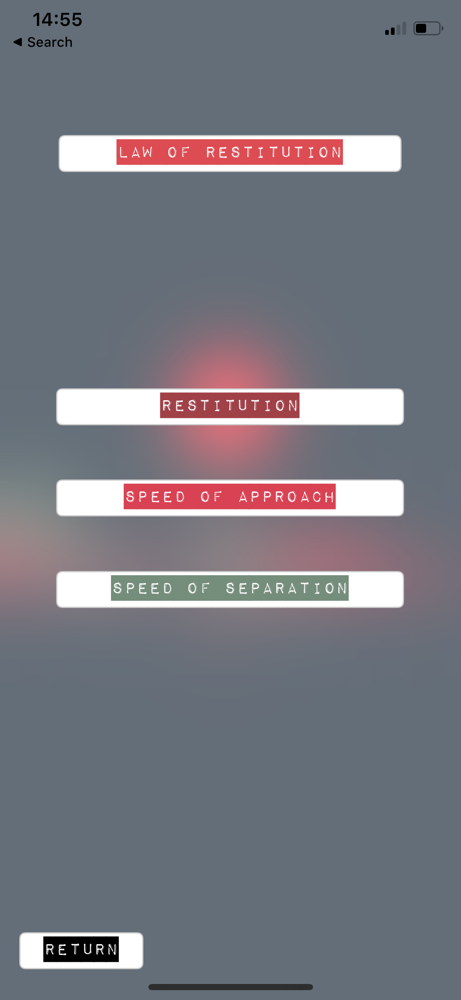
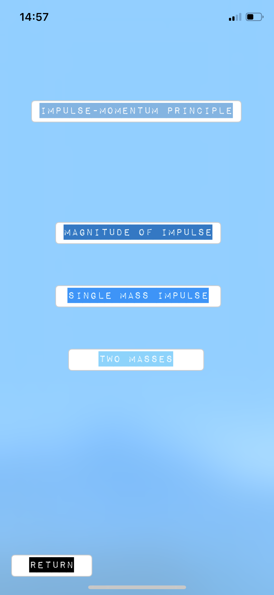
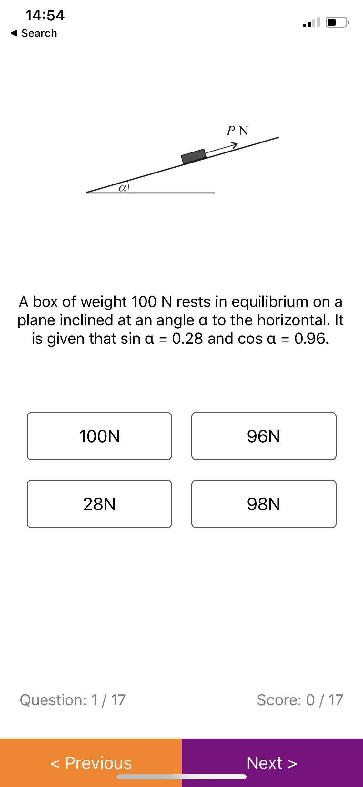

## Adjusting Ad Mob 
To adjust ad mob to generate you money (after seeing the stats i would wonder why you'd want that) you have to change the api keys in the app delegate file. 

## The Future 
Unfortunely there is no future for the mechanics calculator, this was built as a project when I was 16, it was published when i turned 17, and honestly the app is poorly written. If i was to rebuild something like this i'd focus on the market research a lot more and purchase ads to market it better.

## Social Media 
these are my social media's, stay tuned because I will publish the source code to the predecesor of the mechanics calculator, the statistics calculator, this app managed to gain over 3000+ app installs. 
- [Linkden - Elijah Ahmad](https://www.linkedin.com/in/elijah-ahmad-658a2b199/)
- [FaceBook - Elijah Ahmad](https://www.facebook.com/elijah.ahmad.71)
- [Instagram - @ElijahAhmad__](https://www.instagram.com/ElijahAhmad__)
- [Snapchat - @Elijah.Ahmad](https://www.snapchat.com/add/elijah.ahmad)

